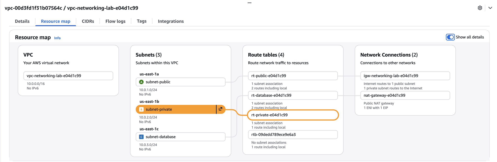
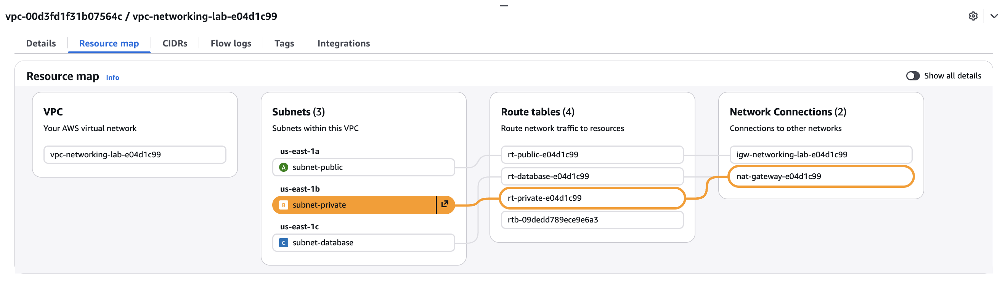
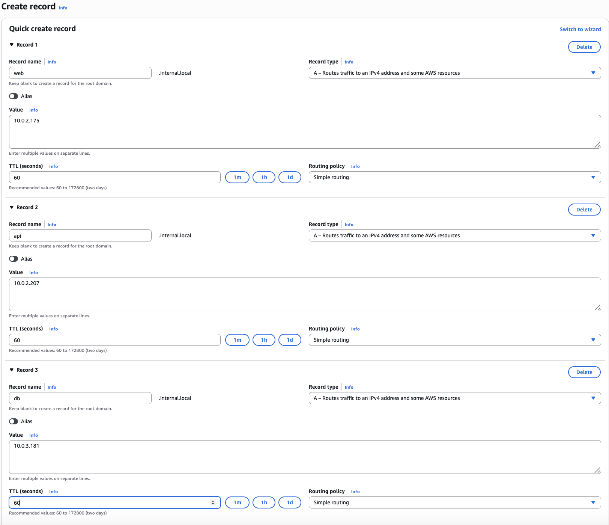
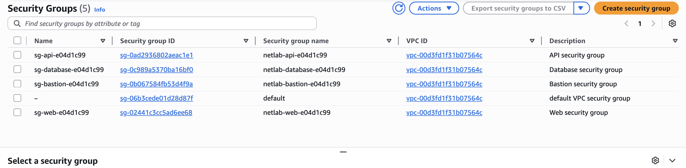

# NETWORKING LAB
> ### 🎫 INC-4521: API service can't pull external data
> ### Priority: High
> ### Reported by: Backend Team
> ### Time: 09:47 AM

"Our API service that runs on the private subnet stopped being able to fetch data from external APIs this morning. We didn't change anything on our end. Requests to third-party services just hang and timeout. Internal calls between our services still work fine."

Affected system: API server (private subnet)

**System Fix: I fixed this by adding the Attaching NAT to the route table at the private subnet.**

> Before:

>After :

### **🎫 INC-4522: Service discovery broken**
Priority: High
Reported by: Platform Team
Time: 10:15 AM

"Our applications can't resolve internal hostnames anymore. We've been using web.internal.local, api.internal.local, and db.internal.local for service discovery but they stopped resolving. Public DNS works fine - we can resolve google.com. This is blocking deployments."

Affected system: All VMs

Fix: DNS cannot resolve internal hostnames however public DNS works. So we need to identify if records specifically A records have been assigned to each Server with assigned Ip address. Amazon ROute 53 is responsible for managing Setting up DNS and hostnames. WE need to assingn each A Record to it's Server Ip in order to resolve internal hostnames.After successfully creating records we need to update information in etc/systemd/resolved.conf . DNS , DNSfallback and DOmain. and create a hard symbolic link to /etc/resolv.conf to make changes and reboot running system.
Commands: sudo vim /etc/systemd/resolved.conf and sudo ln -sf /run/systemd/resolved.conf /etc/resolv.conf

> 

> 🎫 INC-4523: Web frontend can't reach backend
> Priority: Critical
> Reported by: Web Team
> Time: 10:32 AM
> 
> "The web frontend suddenly can't connect to the API backend. We're getting connection refused errors on port 8080. The API health endpoint works when we curl localhost on the API server itself, so the service is running. Also, the API team says they can't reach the database on port 5432."
> 
> Affected systems: Web server → API server, API server → Database

**Fix**: Check security groups and make sure inbound and outbound from web server> api allows communication and also check from Api > Database inbound and outbound and allow traffic. Also check Network ACL.

> 🎫 INC-4524: Security audit findings
> Priority: Medium
> Reported by: Security Team
> Time: 11:00 AM
> 
> "Our quarterly security scan flagged several issues with the network segmentation:
> 
> SSH is accessible from the internet on some hosts (should only be via bastion)
> Database accepts connections from too broad a range (should be API tier only; SG-scoped is preferred)
> ICMP is open from anywhere
> These need to be tightened up before our compliance review next week."
> 
> Affected systems: Security groups / NACLs

 Fix: Basically followed the same instrctions by assingning ssh access only to bastion and databbase only to APi using SG scoped. and allowing ICMP anywhere.
